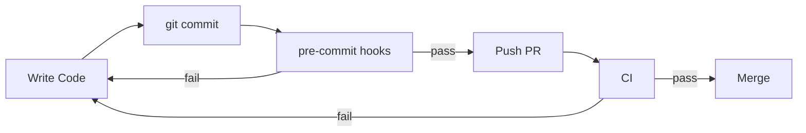

# Onboarding

Welcome! 👋  
This repository is designed to provide **fast feedback**, **strong quality gates**, and **clear expectations** from day one.

If you follow the steps below, you should be able to:

- Get the project running locally
- Make your first PR confidently
- Understand *why* the guardrails exist (not just what they are)

---

## 🚀 Quick start (recommended)

After cloning the repo, run:

```bash
make bootstrap
```

This is the **single supported entry point** for new contributors.

### What `make bootstrap` does

1. Installs Git hooks (`pre-commit`)
2. Verifies required local dependencies
3. Runs the local quality gate (formatting + static checks)
4. Fails fast if your environment is misconfigured

📄 Details: [`MAKEFILE.md`](./files/MAKEFILE.md)

---

## 🧭 How onboarding is structured

Onboarding docs are intentionally **progressive**. You don’t need to read everything at once.

### Day-based flow

| When | What to read |
| ---- | ---- |
| Day 1 | [`DAY_1_ONBOARDING.md`](./DAY_1_ONBOARDING.md) — local setup, expectations |
| Day 2 | [`DAY_2_FIRST_PR.md`](./DAY_2_FIRST_PR.md) — first PR, CI, review flow |

---

## 🧑‍💻 Development workflow

```text
Code → git commit → pre-commit → CI → review → merge
```



- **Pre-commit** enforces ADR-000 locally
- **CI** enforces the same rules authoritatively
- Local bypasses are documented and intentional

📄 Details:

- [`PRECOMMIT.md`](./files/PRECOMMIT.md)
- [`LINTING.md`](./LINTING.md)
- [`docs/adr/ADR-000-linting.md`](../adr/ADR-000-linting.md)

---

## 🧱 Quality gates & ADRs

All non-obvious rules are documented as Architecture Decision Records.

### Core ADRs

- ADR-000 — Linting & quality gates  
- ADR-001 — PostgreSQL everywhere  
- ADR-002 — Testcontainers  
- ADR-003 — Actuator health checks  
- ADR-004 — `.env` & config precedence  
- ADR-005 — Phased security

📄 Index: [`docs/adr/README.md`](../adr/README.md)

---

## 🧪 Testing & CI

📄 Start here:

- [`SETUP_TESTING.md`](./setup/SETUP_TESTING.md)
- [`docs/testing/TESTING.md`](../testing/TESTING.md)
- [`docs/testing/CI_TROUBLESHOOTING.md`](../testing/CI_TROUBLESHOOTING.md)

---

## 🐳 Docker & local services

📄 Docs:

- [`SETUP_DOCKER.md`](./SETUP_DOCKER.md)
- [`docker-compose.yml`](../../docker-compose.yml)

---

## 🛠️ Local dev environment

📄 Docs:

- [`DEV_ENVIRONMENT.md`](./DEV_ENVIRONMENT.md)
- [`DEPENDENCIES.md`](./DEPENDENCIES.md)
- [`.vscode/README.md`](../../.vscode/README.md)

---

## 🧠 Guiding principle

> **Local checks help you. CI protects the system. ADRs explain why.**

Welcome aboard 🚀
